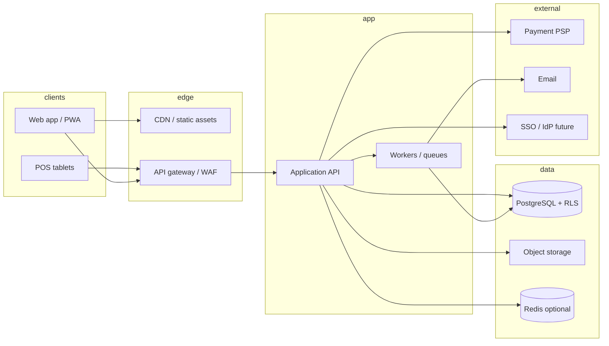

# Hospitality SaaS — Architecture & API Outline

This document complements [HOSPITALITY_SAAS_PRODUCT_PLAN.md](./HOSPITALITY_SAAS_PRODUCT_PLAN.md) with **system architecture**, **security/tenancy mechanics**, and a **REST-style API outline**. Product vision and phased roadmap stay in the product plan.

**External audits (consolidated, Django-templates-only):** [AUDIT_RECOMMENDATIONS.md](./AUDIT_RECOMMENDATIONS.md) relates third-party review findings to this codebase—**without** adopting a separate SPA as the primary staff UI—and lists what is already partially implemented in `backend/`. **Staff vs API surface:** [STAFF_API_PARITY.md](./STAFF_API_PARITY.md).

**Format choice:** One **ARCHITECTURE.md** with an embedded API outline keeps onboarding simple. **OpenAPI 3** is generated by **[drf-spectacular](https://drf-spectacular.readthedocs.io/)** from serializers and views. While the server is running, browse **Swagger UI** at [`/api/v1/schema/swagger-ui/`](http://127.0.0.1:8000/api/v1/schema/swagger-ui/) or **ReDoc** at [`/api/v1/schema/redoc/`](http://127.0.0.1:8000/api/v1/schema/redoc/); raw YAML/JSON from [`/api/v1/schema/`](http://127.0.0.1:8000/api/v1/schema/). A checked-in copy lives at **[openapi.yaml](./openapi.yaml)** — refresh with `python backend/scripts/generate_openapi.py` (repo root) or `python scripts/generate_openapi.py` (`backend/`), which runs `manage.py spectacular --validate`.

---

## 1. System context



---

## 2. Logical layers

| Layer | Responsibility |
|--------|----------------|
| **Presentation** | **Django templates** (`apps/staff/` and shared templates); Bootstrap from CDN; tenant theme from `TenantSettings` (hex → CSS variables); outlet-aware navigation added per view. |
| **Application / API** | AuthZ checks, validation, orchestration, idempotent commands where needed (payments, stock). |
| **Domain** | Pure rules: pricing, tax line calculation, folio posting, inventory movement invariants. |
| **Infrastructure** | Postgres, migrations, RLS policies, file uploads, queue adapters, PSP webhooks. |

Keep **domain rules** testable without HTTP; keep **tenant scope** enforced at DB for defense in depth.

---

## 3. Tenancy and authentication

### 3.1 Identities

- **End users:** JWT or session issued by auth provider; claims include `sub` (user id), `tenant_id`, and optionally `site_ids` / `outlet_ids` or role references.
- **Platform operators:** separate issuer or global role; **no** `tenant_id` in tenant-facing routes.

### 3.2 Request context

Every authenticated tenant request resolves:

1. **Tenant** — from claim or resolved membership (never from client-supplied body alone).
2. **Acting site / outlet** — from header or path (e.g. `X-Site-Id`, `X-Outlet-Id`) validated against user membership.
3. **Permissions** — capability checks before handler logic.

### 3.3 Database session (Postgres)

Preferred pattern with RLS:

- API connects with a **restricted role**; per request runs `SET LOCAL` (or equivalent) for `app.tenant_id`, `app.user_id`, and optionally `app.outlet_ids` used in policies.
- RLS policies reference `current_setting('app.tenant_id', true)` (or session variables your stack supports).

Application code **still** filters by tenant in queries for clarity; RLS is the **safety net** against bugs and SQL injection escalation.

**Implemented in this repo (PostgreSQL only):**

- Migration **`tenants.0003_postgres_row_level_security`** enables RLS and a `tenant_isolation` policy on core tenant-scoped tables (no-op on SQLite).
- Migration **`tenants.0004_extend_postgres_row_level_security`** adds the same pattern for newer tables (promotions, recipe lines, promotion–outlet M2M, offline queue, events, integration links, room rate windows, user invites). Join-based policies cover tables without a direct `tenant_id` (e.g. recipe lines via parent menu item, rate windows via room type).
- Set **`POSTGRES_SET_REQUEST_TENANT_GUC=true`** (env) and keep **`PostgresRequestTenantGucMiddleware`** (after `TenantContextMiddleware`) so each API request with `X-Tenant-Id` runs inside `transaction.atomic()` and executes `SET LOCAL app.tenant_id = '<uuid>'`. Leave the flag **false** for local SQLite and for Django admin unless the DB user bypasses RLS or you use a separate admin connection.

**Unauthenticated tenant routes:** `POST /api/v1/invites/accept/` uses `AllowAny`; middleware skips tenant binding when the user is not authenticated or `X-Tenant-Id` is omitted, so accept works with body `token` + `password` only.

---

## 4. Multi-tenant data model (architecture view)

- **Single database, shared schema** — standard for SaaS MVP; scale with connection pooling, read replicas, partitioning by `tenant_id` later if needed.
- **Soft delete** — optional `deleted_at` on configurable entities; policies hide deleted rows from non-admins.
- **Audit** — append-only `audit_events` (or trigger-based) with JSON `payload` and immutable `tenant_id`.

Cross-tenant reporting for **platform billing** uses a **separate read model** or ETL—not tenant RLS session.

---

## 5. Frontend architecture

- **Stack:** Django template engine only — **no** separate Node/React build. Staff UI lives in **`apps/staff/`** (session auth, `StaffSessionTenantMiddleware` for `request.tenant`).
- **Shell:** `staff/base.html` — layout, nav, Bootstrap 5 (CDN), tenant colors from context; use `messages` for feedback.
- **Features:** add views + templates under `apps/staff/` (or new apps) — `pos`, `lodging`, `inventory`, `reports` as server-rendered pages; URL query strings for filters.
- **Real-time (optional):** HTMX/Alpine or periodic refresh later; WebSockets only if needed.

---

## 6. Async work and integrations

| Concern | Pattern |
|---------|---------|
| Email (invites, reports) | Queue job; retry with backoff |
| PDF / CSV exports | Job; store file in object storage; signed URL |
| Payment webhooks | Dedicated route; verify signature; idempotent by PSP event id |
| Stock reconciliation | Scheduled or on-demand job per site |

---

## 7. Deployment (reference)

- **App:** container or serverless with horizontal scaling; stateless nodes.
- **DB:** managed Postgres, automated backups, PITR; migration pipeline (e.g. Supabase migrations, Flyway, Laravel migrations).
- **Secrets:** environment / secret manager; no secrets in repo.
- **Observability:** request IDs, structured JSON logs, error tracking (Sentry-class), DB slow query logging.
- **Django production (`DJANGO_SETTINGS_MODULE=config.settings.production`):** requires a non-default **`SECRET_KEY`**; enables **HTTPS-oriented cookies**, **HSTS**, **`SECURE_SSL_REDIRECT`**, and optional **`USE_X_FORWARDED_PROTO`** / **`CSRF_TRUSTED_ORIGINS`** (see `config/settings/production.py`). API error bodies use a consistent **`error` + `request_id`** shape (see [AUDIT_RECOMMENDATIONS.md](./AUDIT_RECOMMENDATIONS.md) §5).
- **Celery:** optional background work (`config/celery.py`, tasks under `apps/*/tasks.py`). Development runs tasks **eager** (in-process). Production with **`CELERY_TASK_ALWAYS_EAGER=False`** needs a worker: `celery -A config worker -l info` (broker from **`CELERY_BROKER_URL`** / **`REDIS_URL`**).

---

## 8. API outline (REST)

Conventions below assume **JSON** over HTTPS, **versioned** base path (e.g. `/v1`). Adjust to your framework (Laravel resource routes vs Next route handlers).

### 8.1 Conventions

- **Base URL (generic):** `https://api.example.com/v1`
- **Base URL (Django app in this repo):** `http://127.0.0.1:8000/api/v1` — route inventory in **[openapi.yaml](./openapi.yaml)**.
- **Content-Type:** `application/json`
- **Auth:** `Authorization: Bearer <access_token>`
- **Context headers (tenant app):**
  - `X-Tenant-Id` — optional if encoded in token only; if sent, must match token.
  - `X-Site-Id` — required for site-scoped resources when not in path.
  - `X-Outlet-Id` — required for POS and outlet-scoped writes.
- **Idempotency (payments, voids):** `Idempotency-Key: <uuid>`
- **Errors:** JSON body `{ "error": { "code", "message", "details?" } }` with appropriate HTTP status (400, 401, 403, 404, 409, 422, 429, 500).
- **Pagination:** `?cursor=` or `?page=&per_page=`; response includes `next_cursor` or `meta`.
- **Filtering:** query params, documented per resource.

### 8.2 Resource map

Logical names below omit the **`/api/v1`** prefix. For the checked-in backend, prefix every path with **`/api/v1/`** (see **[openapi.yaml](./openapi.yaml)** for an exact method × path matrix).

#### Auth & session

| Method | Path | Notes |
|--------|------|--------|
| `POST` | `/auth/login` | Conceptual; **this repo:** `POST /api/v1/auth/token/` (JWT pair) |
| `POST` | `/auth/logout` | Not implemented (client discards tokens) |
| `POST` | `/auth/refresh` | **This repo:** `POST /api/v1/auth/token/refresh/` |
| `GET` | `/me` | **This repo:** `GET /api/v1/me/` (JWT only; tenant header optional) |

#### Tenant & platform admin (split surface)

| Method | Path | Notes |
|--------|------|--------|
| `GET` | `/tenant/settings` | **This repo:** `GET /api/v1/tenant/settings/` (`X-Tenant-Id` required) |
| `PATCH` | `/tenant/settings` | **This repo:** `PATCH /api/v1/tenant/settings/` (owner / tenant_admin) |
| `GET` | `/sites` | List sites |
| `POST` | `/sites` | Create site |
| `GET` | `/sites/:siteId` | Detail |
| `PATCH` | `/sites/:siteId` | Update |
| `GET` | `/sites/:siteId/outlets` | List outlets |
| `POST` | `/sites/:siteId/outlets` | Create outlet |

#### Users & access

| Method | Path | Notes |
|--------|------|--------|
| `GET` | `/users` | Filter by site/outlet |
| `POST` | `/users/invites` | **This repo:** `POST /api/v1/invites/` (returns one-time token) |
| `POST` | `/invites/accept` | **This repo:** `POST /api/v1/invites/accept/` (public; token + password) |
| `PATCH` | `/users/:userId` | Roles, memberships |
| `DELETE` | `/users/:userId` | Deactivate |

#### Menu (catalog)

| Method | Path | Notes |
|--------|------|--------|
| `GET` | `/menu/categories` | Scoped by outlet or `?outletId=` |
| `POST` | `/menu/categories` | |
| `GET` | `/menu/items` | Includes modifiers flag |
| `POST` | `/menu/items` | |
| `PATCH` | `/menu/items/:itemId` | |
| `GET` | `/menu/items/:itemId/recipe` | Ingredients / BOM |
| `PUT` | `/menu/items/:itemId/recipe` | Replace recipe lines |
| `GET/POST/PATCH/DELETE` | `/menu/promotions` | Time-bounded discounts (percent XOR fixed amount); optional outlet scope |

#### POS — orders & tables

| Method | Path | Notes |
|--------|------|--------|
| `GET` | `/tables` | By outlet |
| `POST` | `/tables` | |
| `GET` | `/orders` | Filters: status, date, outlet |
| `POST` | `/orders` | Create open ticket |
| `GET` | `/orders/:orderId` | Lines, totals, payments |
| `PATCH` | `/orders/:orderId` | **This repo:** lines via `POST …/lines/`; void via `POST …/void-line/` |
| `POST` | `/orders/:orderId/lines` | **This repo:** `POST /api/v1/orders/<id>/lines/` |
| `DELETE` | `/orders/:orderId/lines/:lineId` | **This repo:** void = `POST …/void-line/` with `line_id` |
| `POST` | `/orders/:orderId/pay` | **This repo:** `POST /api/v1/orders/<id>/payments/` (`Idempotency-Key`); partial pay OK |
| `POST` | `/orders/:orderId/close` | **This repo:** implicit when balance paid (no separate close URL) |
| `POST` | `/orders/:orderId/apply-promotion` | **This repo:** `POST /api/v1/orders/<id>/apply-promotion/` |
| `PATCH` | `/orders/:orderId/lines/:lineId/kds` | **This repo:** `POST /api/v1/orders/<id>/kds-line/` |
| `GET` | `/kds/tickets` | **This repo:** `GET /api/v1/kds/tickets/?outlet=<uuid>` |
| `POST` | `/pos/offline-sync` | **This repo:** `POST /api/v1/pos/offline-sync/` |

#### Lodging

| Method | Path | Notes |
|--------|------|--------|
| `GET` | `/lodging/room-types` | |
| `GET` | `/lodging/rooms` | Status filters |
| `PATCH` | `/lodging/rooms/:roomId` | Housekeeping status |
| `GET` | `/lodging/reservations` | Calendar range query |
| `POST` | `/lodging/reservations` | |
| `GET` | `/lodging/reservations/:id` | |
| `PATCH` | `/lodging/reservations/:id` | |
| `POST` | `/lodging/reservations/:id/check-in` | (implementation path) |
| `POST` | `/lodging/reservations/:id/check-out` | |
| `POST` | `/lodging/reservations/:id/post-folio-charge` | Manual folio line from reservation context (open folio, same site) |
| `GET/POST/PATCH/DELETE` | `/lodging/rate-windows` | Nightly rate windows per room type |
| `GET` | `/lodging/folios/:folioId` | **This repo:** `GET /api/v1/lodging/folios/<id>/` |
| `POST` | `/lodging/folios/:folioId/charges` | **This repo:** `POST /api/v1/lodging/folios/<id>/lines/` |

#### Events (venues)

| Method | Path | Notes |
|--------|------|--------|
| `GET/POST/PATCH/DELETE` | `/events/spaces` | Bookable spaces per site |
| `GET/POST/PATCH` | `/events/bookings` | Bookings on a space |

#### Integrations (registry)

| Method | Path | Notes |
|--------|------|--------|
| `GET/POST/PATCH` | `/integrations/links` | Per-tenant provider keys + JSON settings (no secrets in DB) |

#### Inventory

| Method | Path | Notes |
|--------|------|--------|
| `GET` | `/inventory/items` | **This repo:** balances = `GET /api/v1/stock/balances/` |
| `POST` | `/inventory/movements` | **This repo:** `POST /api/v1/stock/movements/` (manual reasons; not sale/recipe) |
| `GET` | `/inventory/movements` | **This repo:** `GET /api/v1/stock/movements/` |
| `POST` | `/inventory/counts` | **This repo:** `POST /api/v1/stock/count-sessions/` |
| `PATCH` | `/inventory/counts/:id` | **This repo:** `POST …/complete/` or `POST …/cancel/` |

#### Suppliers & purchasing (light)

| Method | Path | Notes |
|--------|------|--------|
| `GET` | `/suppliers` | **This repo:** `GET /api/v1/purchasing/suppliers/` |
| `POST` | `/suppliers` | **This repo:** `POST /api/v1/purchasing/suppliers/` |
| `GET` | `/purchase-orders` | **This repo:** `GET /api/v1/purchasing/purchase-orders/` |
| `POST` | `/purchase-orders` | **This repo:** `POST /api/v1/purchasing/purchase-orders/` |
| `POST` | `/purchase-orders/:id/receive` | **This repo:** `POST /api/v1/purchasing/purchase-orders/<id>/receive/` |

#### Reporting & exports

| Method | Path | Notes |
|--------|------|--------|
| `GET` | `/reports/sales-summary` | **This repo:** `GET /api/v1/reports/sales-summary/` |
| `GET` | `/reports/inventory-valuation` | Optional |
| `POST` | `/exports` | Enqueue CSV/PDF job |
| `GET` | `/exports/:jobId` | Status + download URL |

#### Audit

| Method | Path | Notes |
|--------|------|--------|
| `GET` | `/audit-events` | **This repo:** `GET /api/v1/audit-events/` |

#### Webhooks (platform / PSP)

| Method | Path | Notes |
|--------|------|--------|
| `POST` | `/webhooks/payments/:provider` | Verify signature; idempotent store |

---

## 9. Realtime events (optional)

If using a channel-based model, document events such as:

- `order.created`, `order.updated`, `order.closed` — payload includes `tenant_id`, `outlet_id`, `order_id`.
- `reservation.updated` — for front desk dashboards.

Subscribe only after auth; channel name includes tenant and outlet to prevent leaks.

---

## 10. Evolution

- **`docs/openapi.yaml`** is exported from **drf-spectacular**; regenerate after URL or serializer changes. Next step: generate typed API clients (e.g. **openapi-generator**) from the live schema or the committed file.
- Add **ADR** files (`docs/adr/`) for major decisions (RLS vs app-only scope, single DB vs shard, payment flow).
- Keep this file updated when **deployment topology** or **auth model** changes.

---

## 11. Django reference implementation

A **Django 5** backend lives in **`backend/`** (settings package `config/`, domain apps under `apps/`). **OpenAPI** includes paths, components, and security (JWT + documented **`X-Tenant-Id`** header). Regenerate **[openapi.yaml](./openapi.yaml)** with `python backend/scripts/generate_openapi.py`.

**Local setup (Windows PowerShell):**

```text
cd backend
python -m venv .venv
.\.venv\Scripts\pip install -r requirements.txt
copy .env.example .env
.\.venv\Scripts\python manage.py migrate
.\.venv\Scripts\python manage.py createsuperuser
.\.venv\Scripts\python manage.py runserver
```

**API base:** `http://127.0.0.1:8000/api/v1/`

**Staff UI:** **`apps/staff/`** — session login at **`/staff/login/`**, dashboard at **`/staff/`**. Visual design follows **`docs/HOSPITALITY_SAAS_PRODUCT_PLAN.md` §3** (warm surfaces, sunrise-style gradients, community accent tags, **DM Sans**, tenant hex colors as CSS variables via **`staff-theme.css`** + optional inline overrides from **`TenantSettings`**). Context processor **`staff_branding`** supplies **`tenant_settings`** on **`/staff/*`** when **`request.tenant`** is set. Session key **`staff_tenant_id`**; **`StaffSessionTenantMiddleware`** sets **`request.tenant`** / **`request.tenant_membership`** for ORM-scoped pages.

| Endpoint | Notes |
|----------|--------|
| `GET /api/v1/schema/` | OpenAPI 3 schema (YAML); public (`AllowAny`) |
| `GET /api/v1/schema/swagger-ui/` | Swagger UI |
| `GET /api/v1/schema/redoc/` | ReDoc |
| `GET /api/v1/health/` | Public liveness |
| `POST /api/v1/auth/token/` | JWT pair; body `{"email","password"}` |
| `POST /api/v1/auth/token/refresh/` | Refresh token |
| `POST /api/v1/auth/password/reset/` | **AllowAny**. Body `email`. Always **202** with generic message (no enumeration). Sends email with `uid` + `token` (or link if `PASSWORD_RESET_URL_TEMPLATE` is set). Throttled (anon). |
| `POST /api/v1/auth/password/reset/confirm/` | **AllowAny**. Body `uid`, `token`, `new_password`. Same rules as the HTML flow below. Throttled (anon). |
| `GET/POST /password-reset/confirm/` | **Password reset HTML** (template under `backend/templates/password_reset/`). **GET** with query `uid` + `token` shows a form; **POST** submits hidden `uid`/`token` plus `new_password` (CSRF-protected). |
| `GET /staff/login/` · `POST` (session) | **Staff UI** sign-in (email + password); redirects to **`/staff/`**. |
| `GET /staff/` | **Staff dashboard**; workspace switcher; sites/outlets; quick links. Requires login + session tenant (from middleware). |
| `POST /staff/logout/` | Ends session (CSRF POST). |
| `POST /staff/select-tenant/` | Sets session workspace (`tenant_id`); clears outlet selection. |
| `POST /staff/select-outlet/` | Sets **`staff_outlet_id`** or **`__all__`** for all-outlet lists; body `outlet_id`, `next` (redirect path). |
| `GET /staff/orders/` | Order list (paginated); `?status=open\|closed\|cancelled`; scoped by session outlet unless “All outlets”. |
| `GET /staff/orders/<uuid>/` | Order detail (lines, payments, refunds) — read-only. |
| `GET /staff/tables/` | Tables for the active outlet (single-outlet mode). |
| `GET /staff/menu/` | Menu categories + items (read-only). |
| `GET /staff/reports/sales/` | Sales summary form (`date_from`, `date_to`); same aggregates as **`/api/v1/reports/sales-summary/`**. |
| `GET /api/v1/me/` | Current user + memberships, tenant theme, sites/outlets |
| `GET /api/v1/tenant/settings/` | Tenant branding/regional fields (`default_currency`, `default_timezone`, theme hex colors, `logo_url`, `receipt_footer`). Requires `X-Tenant-Id`. |
| `PATCH /api/v1/tenant/settings/` | Update settings; **owner** or **tenant_admin** only (accountant read-only; other roles cannot patch). |
| `GET/POST /api/v1/menu/categories/` | Menu categories (requires `X-Tenant-Id`) |
| `GET/POST/PATCH /api/v1/menu/items/` | Menu items; list with `?outlet=`, `?barcode=`, `?sku=`. Fields include optional **`kds_station`** (default station for new lines) and **`consume_recipe_on_sale`**: when true, fully paying the order consumes recipe ingredients as **`recipe`** stock movements after **sale** lines. |
| `GET/PUT /api/v1/menu/items/<uuid>/recipe/` | Recipe / BOM: GET returns lines; **PUT** replaces all lines (`ingredient_item`, `quantity_per_unit` sold). |
| `GET/POST/PATCH/DELETE /api/v1/menu/promotions/` | Promotions: **either** `discount_percent` **or** `discount_amount`, optional `starts_at` / `ends_at`, optional **`outlet_ids`** (empty = all outlets), optional `min_order_subtotal`, `is_active`. |
| `GET/POST/PATCH/DELETE /api/v1/menu/modifier-groups/` | Modifier groups (`min_selections`, `max_selections`); nested **options** on read. |
| `GET/POST/PATCH/DELETE /api/v1/menu/modifier-options/` | Modifier options (`price_delta` per unit); filter **`?group=`**. |
| `GET/PATCH /api/v1/menu/items/<id>/` | Menu item may list **`modifier_groups`** and accept **`modifier_group_ids`** (ordered) on write. Order lines accept **`modifier_option_ids`**. |
| `GET/POST /api/v1/orders/` | POS orders; list/detail include **`amount_paid`**, **`balance_due`**, **`payments`**, optional **`applied_promotion`**. List filters `?outlet=&status=`; create: `outlet`, optional `table` / `table_label`, optional **`folio`** (open folio, same site as outlet), `lines[]`. New lines copy **`kds_station`** from the menu item when set. |
| `GET/PATCH /api/v1/orders/<uuid>/` | Patch **`status`**, **`is_paid`** (true only when sum of payments ≥ **`total`**), **`discount_amount`** / **`folio`** only on **open** orders with **no** payments yet (discount locked after partial pay). |
| `POST /api/v1/orders/<uuid>/lines/` | Add a line to an **open** unpaid order; body `menu_item`, `quantity`. |
| `POST /api/v1/orders/<uuid>/void-line/` | Void a line (open orders only); body `line_id`, optional `reason` (audited). Voided lines excluded from totals and from stock deduction. |
| `POST /api/v1/orders/<uuid>/payments/` | **Partial or final** payment: body `amount` (positive, ≤ remaining balance), `method`; header **`Idempotency-Key`** (required). When cumulative payments reach **`total`**, order closes: **`is_paid`**, folio line (if **`folio`**), and stock consumption (sale + optional recipe BOM). |
| `POST /api/v1/orders/<uuid>/apply-promotion/` | Body `promotion_id`. **Open, unpaid** orders only; validates dates, outlet scope, minimum subtotal; sets **`discount_amount`** and **`applied_promotion`**. |
| `POST /api/v1/orders/<uuid>/kds-line/` | Body `line_id`, `kds_status`, optional `kds_station` (max 32 chars). |
| `POST /api/v1/orders/<uuid>/refunds/` | **Closed, paid** orders only. Body `amount`, optional `reason`, optional **`payment_id`** (**required** when the order has **more than one** payment), optional **`restock`**: allowed only with **no** prior refunds and when refunding **full amount paid** on the order in one step; restocks **track_inventory** lines. Header **`Idempotency-Key`** required. Response includes refund with linked **`payment`**. |
| `GET /api/v1/kds/tickets/?outlet=<uuid>` | Open POS orders for the outlet with kitchen lines; query param **`outlet`** required. |
| `GET /api/v1/pos/catalog-version/?outlet=` | Outlet-scoped catalog fingerprint for offline cache invalidation. |
| `POST /api/v1/pos/offline-sync/` | Offline queue replay: `outlet`, `client_mutation_id`, `operation_type` (`order_payment`, `order_create`, `order_add_lines`), typed `payload`. Unique per tenant + `client_mutation_id`. |
| `POST /api/v1/pos/offline-sync/batch/` | Up to 50 ops; same fields per op plus optional **`depends_on`** on **`order_add_lines`** / **`order_payment`** to supply **`order_id`** from a prior result’s **`applied_order_id`**. |
| `POST /api/v1/invites/` | Authenticated + tenant context; **CanManageTenantSettings** and not read-only. Body `email`, optional `role`, optional `expires_days` (1–30). Returns invite id + one-time **`token`**. |
| `POST /api/v1/invites/accept/` | **AllowAny** (no `X-Tenant-Id` required). Body `token`, `password` (≥ 8 chars). |
| `GET /api/v1/reports/sales-summary/` | Query **`date_from`**, **`date_to`** (`YYYY-MM-DD`), optional **`outlet`**. Returns payment totals, refund totals, net sales, breakdown by payment method and by outlet. |
| `GET /api/v1/reports/operations-rollup/` | Same date query as sales summary; adds **`by_day`** array (payments, refunds, net per calendar day). |
| `POST /api/v1/integrations/payment-webhook/` | Inbound PSP stub: headers **`X-Tenant-Id`**, **`X-Webhook-Secret`** (must match **`PAYMENT_WEBHOOK_SHARED_SECRET`**), JSON **`event_id`**. Idempotent; writes **`audit_events`**. |
| `GET/POST/PATCH/DELETE /api/v1/tables/` | Dining tables per outlet; filter `?outlet=<uuid>` |
| `GET/POST/PATCH/DELETE /api/v1/lodging/room-types/` | Room types per site |
| `GET/POST/PATCH/DELETE /api/v1/lodging/rooms/` | Rooms; filter `?room_type=<uuid>` |
| `GET/POST/PATCH /api/v1/lodging/reservations/` | Reservations; filters `?site=`, `?status=` |
| `POST /api/v1/lodging/reservations/<id>/check-in/` | **Held/confirmed** → **checked_in**; requires **room** assigned. Posts **room-night** **folio lines** for each date in **[check_in, check_out)** when a **rate window** exists for that night (opens/creates guest **folio** if needed). |
| `POST /api/v1/lodging/reservations/<id>/check-out/` | **Checked in** → **checked_out**; sets assigned **room** status to **dirty** (housekeeping). |
| `POST /api/v1/lodging/reservations/<id>/post-folio-charge/` | Body `folio_id`, `description`, `amount`, optional `tax_amount`. Folio must be **open** and on the **same site** as the reservation. |
| `GET/POST/PATCH/DELETE /api/v1/lodging/rate-windows/` | Nightly rate windows per **room type** (`valid_from`, optional `valid_to`, `nightly_amount`); list filter `?room_type=<uuid>`. |
| `GET/POST/PATCH /api/v1/lodging/folios/` | Guest / house folios; **POST** `site`, `guest_name`, optional `reservation`, `currency`, `notes`. **PATCH** `status` only (`open` → `closed`). List filters `?site=`, `?status=`. |
| `POST /api/v1/lodging/folios/<id>/lines/` | Manual charge on an **open** folio: `description`, `amount`, optional `tax_amount`. |
| `GET /api/v1/audit-events/` | Append-only audit trail (list/detail) |
| `GET/POST/PATCH/DELETE /api/v1/events/spaces/` | Event spaces per **site**; list filter `?site=<uuid>`. |
| `GET/POST/PATCH /api/v1/events/bookings/` | Event bookings on a space; list filters `?space=`, `?status=`. |
| `GET/POST/PATCH /api/v1/integrations/links/` | Per-tenant integration registry (`provider_key`, `label`, `settings` JSON, `is_enabled`). Writes require **CanManageTenantSettings** + not read-only; **DELETE** not exposed on the viewset. |

**Tax:** menu items may set `tax_rate_percent` (0–100). Order lines store pre-tax `line_total` and `tax_amount`; order `subtotal`, `tax_total`, and **`total`** = `max(0, subtotal + tax_total - discount_amount)` (recomputed when lines change, voids occur, or discount updates).

**Roles:** members with role **accountant** may use **GET** on tenant APIs but not **POST/PATCH/DELETE** (including payments and lodging writes).

**Retail / supermarket:** use outlet types **`retail`** or **`supermarket`**. Catalog items support **barcode**, **unit_of_measure** (`each` / `kg` / `lb` / `liter`), **`track_inventory`**, **`reorder_level`**. Stock is **deducted when the order becomes fully paid** (same POS payment flow): **sale** movements for sold lines, then **recipe** movements for menu items with **`consume_recipe_on_sale`** and a defined BOM.

| Endpoint | Notes |
|----------|--------|
| `GET /api/v1/stock/balances/` | On-hand per outlet; `?outlet=`; `?low_stock=true` uses `reorder_level` |
| `GET/POST /api/v1/stock/movements/` | List history; **POST** receive / adjust-in / adjust-out / waste (`quantity_change` sign must match reason). **Sale** and **recipe** movements are system-only (POS payment / recipe BOM). Filters `?transfer_batch=<uuid>`, `?purchase_order=<uuid>`. Receive-via-PO also sets `purchase_order` on movements (see purchasing). |
| `POST /api/v1/stock/transfers/` | Inter-outlet transfer: `from_outlet`, `to_outlet`, `menu_item`, `quantity`, optional `note`. Returns `transfer_batch` + movement ids. Requires access to both outlets. |
| `GET/POST /api/v1/stock/count-sessions/` | Start a **draft** count (`outlet`, `note`). List/filter `?outlet=`, `?status=`. |
| `POST /api/v1/stock/count-sessions/<id>/complete/` | Body `{ "lines": [ { "menu_item": "<uuid>", "counted_quantity": "10" }, ... ] }` — sets on-hand to counted values, writes **`physical_count`** movements and **count lines** (audit). |
| `POST /api/v1/stock/count-sessions/<id>/cancel/` | Cancel a **draft** session only. |
| `GET/POST/PATCH /api/v1/purchasing/suppliers/` | Suppliers per tenant (`name` unique per tenant). |
| `GET/POST/PATCH /api/v1/purchasing/purchase-orders/` | **POST** draft PO: `supplier`, `outlet`, optional `reference`, `expected_date`, `notes`, `lines[]` (`menu_item`, `quantity_ordered`, optional `unit_cost`). **PATCH** `status`: `draft`→`sent` or `cancelled` (cancel only if nothing received). List filters `?supplier=`, `?outlet=`, `?status=`. |
| `POST /api/v1/purchasing/purchase-orders/<id>/receive/` | Body `{ "lines": [ { "line_id": "<uuid>", "quantity": "10" }, ... ] }` — increases stock at the PO’s outlet with reason **receive**, links **`StockMovement.purchase_order`**, updates line `quantity_received` and PO status (`partially_received` / `received`). |
| `GET /api/v1/menu/items/resolve/` | Same as list filters but returns **one** row or **404**: `?barcode=` and optional `?outlet=` |

Optional header **`X-Tenant-Id`** (tenant UUID): validated against the user’s **membership**; sets `request.tenant` for downstream views (middleware). Omit on routes that only need `me/`, `health/`, or auth tokens.

**Admin:** `http://127.0.0.1:8000/admin/` — manage tenants, sites, outlets, users, memberships.

*Last updated: March 28, 2026*
